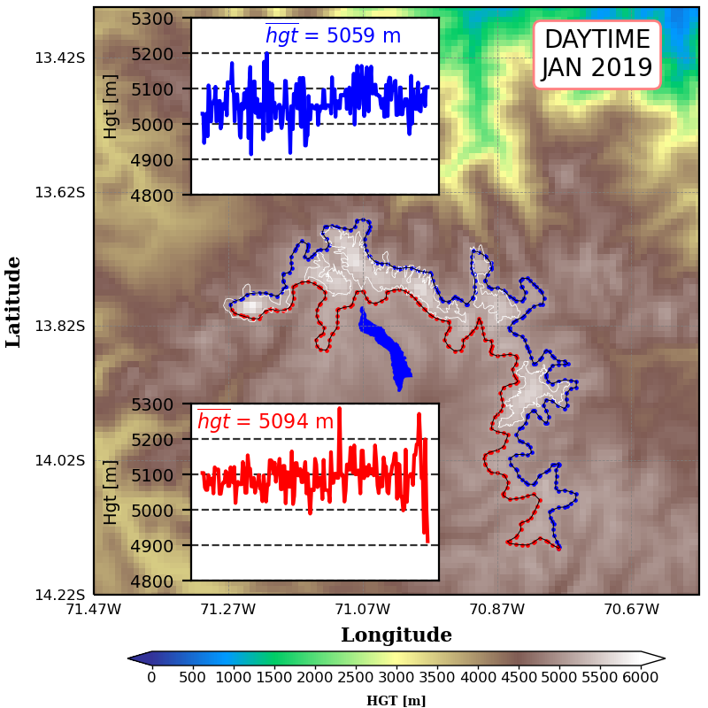

<H1 align="left"><b>Services</b> </H1>

<h2>Agriculture</h2>
<ul class="Agriculture">
	<li>Climatic studies of thermal suitability indices to identify areas and periods of time, where temperature conditions are optimal for crop development.</li>	
</ul>

<h2>Atmosphere</h2>
<ul class="Atmosphere">
	<li>Climatic studies of precipitation, air temperature, air quality, cloud cover and wind speed.</li>	
</ul>

<h2>Oceanography</h2>
<ul class="Oceanography">
	<li>Climatic studies of sea surface temperature, sea surface salinity, ocean surface currents and biogeochemical variables.</li>
</ul>  

<h2>Hydrology and glaciology</h2>
<ul class="Hydrology">
	<li>Climatic studies of river flow</li>
	<li>Climatic studies of snow depth and surface fluxes from snow melt (only for tropical glaciers).</li>
</ul>

        

            <button data-category="category1">Categoría 1</button>
            <button data-category="category2">Categoría 2</button>
            <button data-category="category3">Categoría 3</button>
        

        

            
        

        

            <button id="prevButton">Anterior</button>
            <button id="nextButton">Siguiente</button>
            <button id="playButton">Reproducir</button>
            <button id="stopButton">Detener</button>
        

